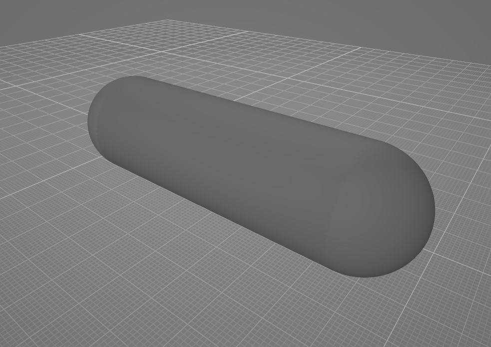
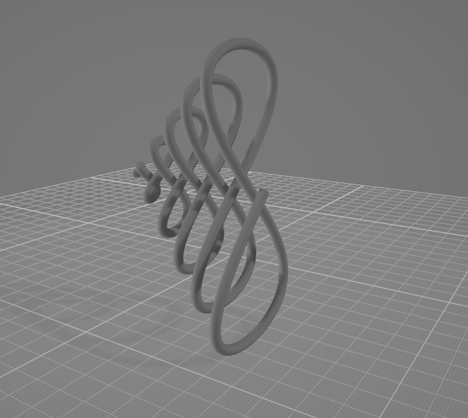

# Утилита генерации 3D фигур в формате ply-файла

Для создания просто геметрической фигуры указываются её составные части - ребра, вершины, грани.  
Пример создания простой фигуры:  
```python
from base_figure3d import Point, Edge
# Задаем точки в пространстве
A = (0, 0, 0)
B = (5, 0, 0)
# Указываем размер для вершин и ребер
R = 1
# Создаем фигуру, состоящую из двух вершин и ребра между ними
figure = Point(A, R) + Point(B, R) + Edge(A, B, R)
# Сохраняем ply файл, в качестве параметра - имя файла
figure.save_ply("Figure")
```  
Открыв файл в программе для просмотра 3D объектов, можно увидеть результат:  


Для создания линии в пространстве нужно указать параметрическую функцию для трех координат - x, y и z.  
Пример создания простой линии:  
```python
from base_line3d import Line3D
from math import sin, cos, pi
# Задаем параметрическое уравнение кривой
def f(t):
    return (
        t * cos(t) * sin(t),
        t * sin(t),
        t
    )
# Начальное значение параметра
START_T = 0
# Конечное значение параметра
END_T = 10 * pi
# Указываем толщину линии
R = 1
line = Line3D(f, START_T, END_T, R)
# Сохраняем ply файл, в качестве параметра - имя файла
line.save_ply("Line")
```  
Открыв файл в программе для просмотра 3D объектов, можно увидеть результат:  
